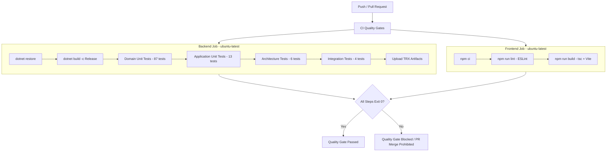

# CI Quality Gates Specification & Verification

**Repository:** `Enterprise-Grade AI-Assisted Internal IT Service Request & Knowledge Management Platform`  
**CI Platform:** GitHub Actions (`.github/workflows/ci.yml`)  
**Status:** Verified & Active  

---

## 1. Quality Gates Overview

The continuous integration (CI) pipeline implements a multi-stage, fail-fast verification process for all code merged into `main`, `dev`, or `staging`.



---

## 2. Gate Criteria & Exit Code Enforcement

| Stage | Command | Purpose | Gate Condition | Fail Behavior |
| :--- | :--- | :--- | :--- | :--- |
| **Backend Restore** | `dotnet restore ServiceDesk.sln` | Ensure all NuGet dependencies resolve | Exit code 0 | Pipeline halts immediately |
| **Backend Build** | `dotnet build ServiceDesk.sln -c Release --no-restore` | Compile with zero compiler errors/warnings-as-errors | Exit code 0 | Pipeline halts immediately |
| **Domain Tests** | `dotnet test tests/ServiceDesk.Domain.Tests` | 87 domain business rule tests | 100% pass, 0 failures | Quality gate fails |
| **Application Tests** | `dotnet test tests/ServiceDesk.Application.Tests` | 13 application service tests | 100% pass, 0 failures | Quality gate fails |
| **Architecture Tests** | `dotnet test tests/ServiceDesk.ArchitectureTests` | 6 Clean Architecture dependency tests | 100% pass, 0 violations | Quality gate fails |
| **Integration Tests** | `dotnet test tests/ServiceDesk.IntegrationTests` | 4 Testcontainers PostgreSQL tests | 100% pass, 0 failures | Quality gate fails |
| **Frontend Install** | `npm ci` | Deterministic package installation | Exit code 0 | Pipeline halts |
| **Frontend Lint** | `npm run lint` | ESLint 9 code style and hooks check | Exit code 0 | Quality gate fails |
| **Frontend Build** | `npm run build` | TypeScript `tsc -b` and Vite bundle | Exit code 0, bundle emitted | Quality gate fails |

---

## 3. Local Verification Evidence

The exact commands configured in CI were verified locally on the development machine with the following results:

### 3.1 Backend Tests
```bash
$ dotnet test src/backend/ServiceDesk.sln -c Release
Passed!  - Failed: 0, Passed: 87, Skipped: 0, Total: 87, Duration: 84 ms  - ServiceDesk.Domain.Tests.dll (net10.0)
Passed!  - Failed: 0, Passed: 13, Skipped: 0, Total: 13, Duration: 106 ms - ServiceDesk.Application.Tests.dll (net10.0)
Passed!  - Failed: 0, Passed:  6, Skipped: 0, Total:  6, Duration: 188 ms - ServiceDesk.ArchitectureTests.dll (net10.0)
Passed!  - Failed: 0, Passed:  4, Skipped: 0, Total:  4, Duration: 2 s    - ServiceDesk.IntegrationTests.dll (net10.0)

Total: 110 Passed, 0 Failed, 0 Skipped (Exit code: 0)
```

### 3.2 Frontend Lint & Build
```bash
$ cd src/frontend/service-desk-web
$ npm run lint
LINT_EXIT: 0

$ npm run build
vite v6.4.3 building for production...
✓ 1492 modules transformed.
dist/index.html                  0.34 kB │ gzip:   0.25 kB
dist/assets/index-CwTfz9R5.js  338.29 kB │ gzip: 110.45 kB
✓ built in 7.62s
BUILD_EXIT: 0
```
